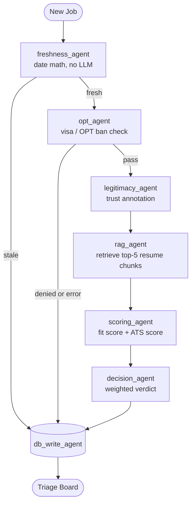

<div align="center">

# Job_Seekr

### An agentic, RAG-powered job application platform that sources, triages, and tailors — automatically.

[](https://www.python.org/)
[](https://langchain-ai.github.io/langgraph/)
[](https://www.trychroma.com/)
[](https://groq.com/)
[](https://streamlit.io/)
[](https://www.sqlite.org/)
[](https://playwright.dev/)

</div>

---

## Overview

**Job_Seekr** is a Python-native job application automation platform built around a
**multi-agent LLM pipeline**. It continuously sources fresh job postings, runs each one
through a **7-agent LangGraph triage graph**, and produces a ranked, decision-ready board
of opportunities — then tailors an ATS-optimized, one-page resume PDF for the strongest matches.

It is a working end-to-end system that demonstrates production patterns an AI engineer is
expected to know: **retrieval-augmented generation, structured LLM outputs, multi-agent
orchestration, model fallback routing, output evaluation, and LLM observability** — all
grounded in a real problem rather than a toy demo.

> Built for an F1-OPT job search: every posting is automatically checked for visa-hostile
> language before a single token is spent scoring it.

---

## What It Does

```
   SOURCE              TRIAGE                 TAILOR              APPLY
┌───────────┐    ┌──────────────────┐    ┌──────────────┐    ┌──────────────┐
│ ATS APIs  │    │ 7-agent LangGraph│    │ RAG-grounded │    │ Playwright   │
│ + Apify   │ ─► │ pipeline:        │ ─► │ LLM rewrite  │ ─► │ form filling │
│ scrapers  │    │ filter → score   │    │ → 1-page PDF │    │ (Phase 4)    │
└───────────┘    └──────────────────┘    └──────────────┘    └──────────────┘
```

1. **Sources** fresh jobs from public ATS APIs and LinkedIn/Indeed scrapers.
2. **Filters** out stale postings and visa-hostile listings before any scoring cost.
3. **Scores** each match through a RAG-augmented, dual-lens evaluation (recruiter fit + ATS keyword overlap).
4. **Tailors** an ATS-safe, one-page resume PDF for strong matches — with a hallucination check so nothing is invented.
5. **Auto-applies** via browser automation *(Phase 4 — planned)*.

---

## Architecture

### The Triage Pipeline — a LangGraph multi-agent graph

Every job flows through a directed state graph. Each stage is an **independent agent**
that reads and writes a shared `JobState`. Conditional edges route a job forward or to an
early exit — stale and visa-blocked jobs never reach the expensive scoring agents.



| Agent | Role | LLM? |
|-------|------|------|
| `freshness_agent` | Drops postings older than 3 days | No — pure date math |
| `opt_agent` | Detects visa-sponsorship bans / citizenship requirements | Yes — fast 8B model |
| `legitimacy_agent` | Annotates posting trustworthiness (never blocks) | Yes — fast 8B model |
| `rag_agent` | Embeds the JD, retrieves the 5 most relevant resume chunks | No — vector search |
| `scoring_agent` | Dual-lens scoring on RAG context | Yes — 70B model |
| `decision_agent` | Combines scores into a `Passed` / `Low Match` verdict | No — weighted math |
| `db_write_agent` | The only agent that touches SQLite | No |

**Why LangGraph over a plain loop?** Each node is independently testable and retryable,
routing logic is explicit instead of buried in `if/continue` chains, and the shared state
makes data flow — and observability — transparent.

### RAG Layer

Instead of sending an entire resume to the LLM on every scoring call, the `rag_agent`
retrieves only what's relevant:

```
Resume ──chunk──► [Summary] [Skills] [Role 1] [Role 2] [Project A] [Project B] ...
                       │
                  embed (all-MiniLM-L6-v2, 384-dim)
                       │
                  ChromaDB  ◄── cosine similarity ── embed(Job Description)
                       │
                  top-5 most relevant chunks ──► augmented LLM prompt
```

- **ChromaDB `PersistentClient`** — local, no server, no cost; embed once, reuse forever.
- **`all-MiniLM-L6-v2`** — 384-dim sentence embeddings, runs on CPU.
- **Metadata filtering** — chunks are tagged by role type, so retrieval only ever
  considers the resume relevant to that job.

### Dual-Lens Scoring

Each job is scored two ways, then combined — **fit weighted at 70%**, because conceptual
strength matters more than exact keyword overlap (a strong candidate can learn the tool):

- **Fit score** — recruiter lens: *does the candidate's experience genuinely demonstrate
  what this role needs, even under different vocabulary?*
- **ATS score** — scanner lens: *surface-level keyword and named-technology overlap.*

---

## Tech Stack

| Layer | Technology | Why |
|-------|-----------|-----|
| **Agent orchestration** | LangGraph | Explicit state graph, conditional routing, built-in tracing |
| **LLM — primary** | Groq · `llama-3.3-70b-versatile` | Fast inference, generous free tier |
| **LLM — fallback** | Groq `8b-instant` → Gemini `2.0-flash` | 3-tier routing keeps the pipeline alive past rate limits |
| **Structured outputs** | Pydantic + Groq JSON mode | Validated response shapes — zero regex parsing |
| **RAG / vectors** | ChromaDB + `sentence-transformers` | Local, free, persistent semantic search |
| **Database** | SQLite | Jobs, resumes, and an `llm_logs` observability table |
| **Job sourcing** | Greenhouse / Lever / Ashby APIs + Apify | Free ATS feeds plus LinkedIn/Indeed scraping |
| **PDF rendering** | Playwright (Chromium) | Headless HTML → pixel-accurate one-page Letter PDF |
| **Dashboard** | Streamlit | Triage Board, Sourcing, and Resume Manager views |

---

## Engineering Highlights

- **Multi-agent design** — a 7-node LangGraph graph with a typed shared state and
  conditional early-exit edges, replacing a monolithic sequential script.
- **Retrieval-Augmented Generation** — JD-to-resume semantic retrieval keeps LLM context
  tight, cheaper, and more accurate than dumping a full resume into every prompt.
- **Structured outputs** — every LLM response is validated against a Pydantic model;
  invalid shapes degrade gracefully instead of crashing the pipeline.
- **Resilient model routing** — automatic fallback (`Groq 70B → Groq 8B → Gemini`) so a
  daily rate cap never stops a run.
- **Output evaluation** — a custom eval layer measures **keyword coverage %** and runs a
  **hallucination detector** that flags any technology the LLM added but the candidate
  never claimed. Honest tailoring is enforced, not assumed.
- **LLM observability** — every model call is logged to SQLite (model, provider, latency)
  for a lightweight MLOps view of cost and performance.
- **Cost discipline** — cheap deterministic checks run first; the expensive 70B model is
  only reached for jobs that survive freshness and visa filtering. A `DRY_RUN` mode skips
  all API calls entirely during development.

---

## Resume Tailoring Engine

For strong matches, Job_Seekr generates a tailored resume on demand:

1. RAG-retrieves the relevant resume sections for the job description.
2. The LLM reframes the summary, bullets, and competency grid using the JD's exact
   vocabulary — **reformulating real experience, never inventing it**.
3. The eval layer verifies keyword coverage and scans for hallucinated skills.
4. Playwright renders the result to a **strictly one-page, ATS-safe Letter PDF**
   (single-column, selectable text, standard section headers).

A score-based gate decides when tailoring is even worth it — skill-gap jobs and
already-excellent matches are skipped automatically.

---

## Project Structure

```
Job_Seekr/
├── app.py            # Streamlit dashboard — Triage Board, Sourcing, Resume Manager
├── pipeline.py       # LangGraph 7-agent triage graph
├── llm.py            # LLM clients, fallback routing, Pydantic models, call logging
├── rag.py            # ChromaDB: chunk → embed → cosine retrieve
├── sourcer.py        # Track A (ATS APIs) + Track B (Apify) sourcing engine
├── tailor.py         # LLM tailoring engine + Playwright PDF renderer
├── eval.py           # Keyword coverage + hallucination evaluator
├── db.py             # SQLite schema, CRUD, llm_logs table
├── templates/
│   └── cv-template.html   # HTML resume template rendered by Playwright
├── resumes/          # Base markdown resumes (Data Analyst / Business Analyst / AI)
├── portals.yml       # Greenhouse / Lever / Ashby company targets
└── requirements.txt
```

---

## Getting Started

### Prerequisites

- Python 3.10+
- A free [Groq API key](https://console.groq.com/) and [Gemini API key](https://aistudio.google.com/)
- *(Optional)* an [Apify API key](https://apify.com/) for LinkedIn/Indeed sourcing

### Installation

```bash
git clone https://github.com/DeepanshSharma/Job_Seekr.git
cd Job_Seekr

python -m venv venv
source venv/bin/activate          # Windows: venv\Scripts\activate

pip install -r requirements.txt
playwright install chromium
```

### Configuration

Create a `.env` file in the project root:

```ini
GROQ_API_KEY=your_groq_key
GEMINI_API_KEY=your_gemini_key
APIFY_API_KEY=your_apify_key       # optional — only for Track B sourcing

DRY_RUN=false                      # true = skip all API calls, use preset scores
```

### Run

```bash
streamlit run app.py
```

Open the dashboard, head to **Sourcing** to pull live jobs, and watch the
**Triage Board** fill with scored, ranked matches.

---

## Roadmap

| Phase | Status | Description |
|-------|--------|-------------|
| 1 — Triage Board | Done | OPT filter, legitimacy check, dual fit + ATS scoring |
| 2 — Tailoring Engine | Done | RAG-grounded LLM rewriting + Playwright one-page PDF |
| 3 — Live Sourcing | Done | ATS APIs (Track A) + Apify LinkedIn/Indeed (Track B) |
| AI Refactor | Done | LangGraph pipeline, ChromaDB RAG, Pydantic outputs, eval + observability |
| 4 — Auto-Apply | Planned | Playwright form filling + LinkedIn Easy Apply submission |

---

## License

A personal portfolio project, built and maintained by **Deepansh Sharma**.
